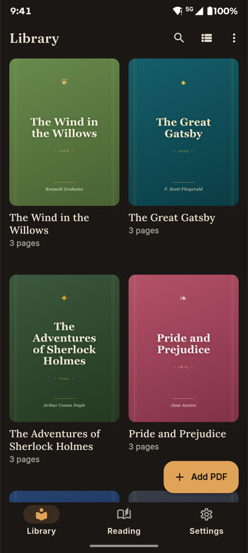
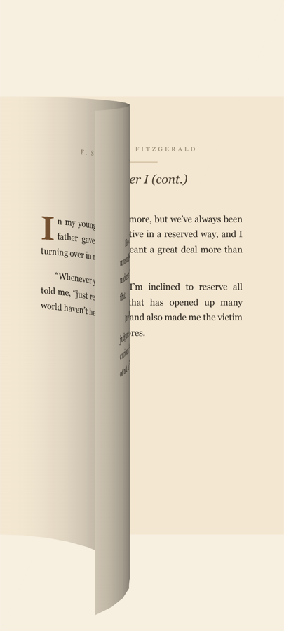
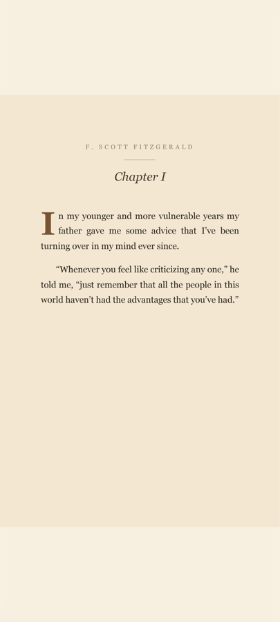
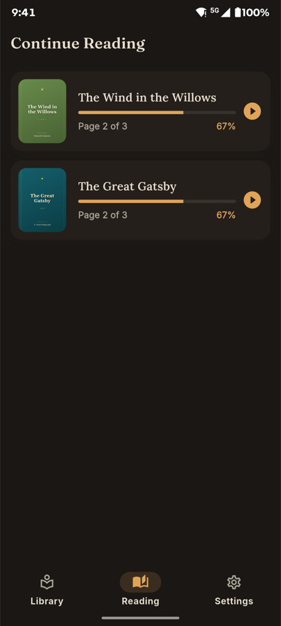
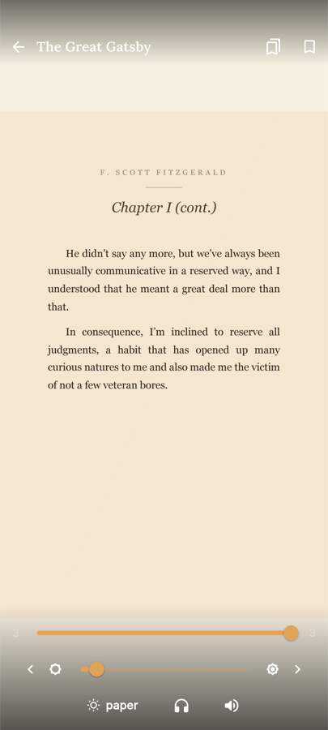
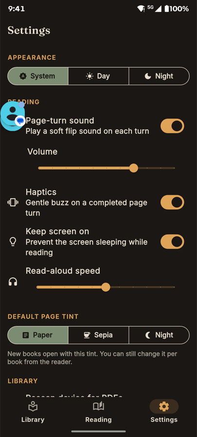

<div align="center">


# Comfy Reader

### _Read like it's a real book._

A premium, cozy **PDF reader** where documents open and turn like a real
physical book — a Kindle-style **3D page-curl** with a tactile page-turn sound,
an animated splash, an auto-discovering library with rendered covers, resume
reading, bookmarks, and **Day / Sepia / Night** comfort tints. One Flutter
codebase for **Android** (primary) and **iOS**.

<br />


</div>

---

## ✨ Highlights

|                                  |                                                                                                                                                 |
| -------------------------------- | ----------------------------------------------------------------------------------------------------------------------------------------------- |
| 📖 **Real page-turns**           | A vendored 3D page-curl engine bends each page in real time as you drag — complete with a soft paper-flip sound and a gentle haptic on release. |
| 🗂️ **Auto-discovering library**  | Scans your device for PDFs and renders a real cover from each book's first page, throttled so scrolling stays buttery.                          |
| ☕ **Comfort tints**             | Switch any book between **Paper**, **Sepia**, and **Night** — Night inverts luminance so white pages become easy-on-the-eyes dark.              |
| 🔖 **Resume, bookmarks & go-to** | Always reopens where you left off, with a progress scrubber, per-page bookmarks, and a “Continue Reading” shelf.                                |
| 🎧 **Read-aloud**                | Offline text-to-speech using the OS-native engines — no API keys, no network.                                                                   |
| 🌗 **Brightness & wakelock**     | In-reader brightness slider and an optional keep-screen-on while you read.                                                                      |

---

## 📸 Screenshots

<div align="center">

<table>
  <tr>
    <td align="center" width="50%">
      <br />
      <b>Auto-discovering library</b>
    </td>
    <td align="center" width="50%">
      <br />
      <b>Signature 3D page-curl</b>
    </td>
  </tr>
</table>

<br />

<b>One tap switches the whole page between three reading comforts</b>

<table>
  <tr>
    <td align="center" width="33%">
      <br />
      ☀️ <b>Day · Paper</b>
    </td>
    <td align="center" width="33%">
      <br />
      ☕ <b>Sepia</b>
    </td>
    <td align="center" width="33%">
      <br />
      🌙 <b>Night</b>
    </td>
  </tr>
</table>

<br />

<table>
  <tr>
    <td align="center" width="25%">
      <br />
      <b>Animated splash</b>
    </td>
    <td align="center" width="25%">
      <br />
      <b>Continue Reading</b>
    </td>
    <td align="center" width="25%">
      <br />
      <b>Reader controls</b>
    </td>
    <td align="center" width="25%">
      <br />
      <b>Settings</b>
    </td>
  </tr>
</table>

<sub>Captured on a Motorola Edge 50 Pro. Sample library uses public-domain titles.</sub>

</div>

---

> See [plan.md](plan.md) for the full execution plan and
> [PROGRESS_LOG.md](PROGRESS_LOG.md) for the timestamped build history.
> Manual test checklist: [QA.md](QA.md).

## Requirements

- **Flutter 3.41.4** (stable) / **Dart 3.11.1** (`sdk: ^3.11.1`)
- Android: Android Studio + an SDK/emulator (minSdk inherits Flutter defaults; PDFium needs ≥ 21)
- iOS: Xcode + CocoaPods (`pod --version`); a Mac to build

## First-time setup

```bash
flutter pub get
# iOS only (first run / after adding plugins):
cd ios && pod install && cd ..
```

## Run (debug)

```bash
flutter run                       # whichever device/emulator is attached
flutter run -d emulator-5554      # a specific Android emulator
flutter run -d <ios-simulator-id> # an iOS simulator (see: xcrun simctl list devices)
```

**Fast dev-loop (used during development):** keep one `flutter run` alive with a
PID file, then hot-reload/-restart by signal instead of restarting:

```bash
flutter run -d emulator-5554 --pid-file=/tmp/cr.pid
kill -USR1 $(cat /tmp/cr.pid)   # hot reload  (~4s)
kill -USR2 $(cat /tmp/cr.pid)   # hot restart (~10s)
```

> Note: on an x86 Android emulator the first cold frame can take ~55–100s and
> the first PDF page render is slow — both are JIT/software-render artifacts, not
> app bugs. Profile and measure performance on a **real device**.

## Build (release)

### Android

```bash
flutter build apk --release          # single APK (sideload / direct install)
flutter build appbundle --release    # AAB for Google Play
```

- **Signing:** the project currently uses **debug signing for release builds**
  (placeholder). Before shipping, add a real keystore and a
  `android/key.properties`, and wire `signingConfigs.release` in
  `android/app/build.gradle.kts`. See
  [Flutter app signing](https://docs.flutter.dev/deployment/android#signing-the-app).
- **`MANAGE_EXTERNAL_STORAGE`:** the library's device-scan feature requests this
  broad permission (PDFs aren't "media", so `READ_MEDIA_*` doesn't cover them).
  It triggers a **Google Play sensitive-permission declaration** at submission.
  If you'd rather not ship it, remove the permission from
  `android/app/src/main/AndroidManifest.xml`: the app still works fully via the
  **+ Add PDF** picker (import-only); only automatic device discovery is lost.

### iOS

```bash
flutter build ios --release          # device build (requires a signing team)
flutter build ios --simulator        # simulator build (no signing needed)
```

- Set your signing **Team** in Xcode (`ios/Runner.xcworkspace` → Signing &
  Capabilities) before a device/release build.
- iOS is **sandboxed**: there is no device scan. PDFs are added via the system
  document picker (**+ Add PDF**), which copies them into the app's Documents
  dir. `Info.plist` enables `UIFileSharingEnabled` + `LSSupportsOpeningDocuments­InPlace`.
  > Known gap: tapping "Open with Comfy Reader" from the Files app launches the
  > app but does not yet auto-import the file — an incoming-URL handler is a
  > tracked follow-up (see [PROGRESS_LOG.md](PROGRESS_LOG.md), Step 6.6).

## Tests & analysis

```bash
flutter analyze     # must be clean
flutter test        # unit tests (models, theme, PDF probe, concurrency)
```

## Project layout

```
lib/
  core/        theme tokens, constants, router, utils (semaphore, paths)
  models/      BookModel, BookmarkModel, AppSettings, enums (map-based, no codegen)
  services/    pdf, storage (Hive), settings, library, audio, permission
  providers/   Library / Reader / Settings  (provider + ChangeNotifier)
  features/    splash · home · reader · settings  (screens + widgets)
  shared/      reusable widgets (Pressable, ShimmerBox, permission dialog)
  flip_book/   vendored RealisticFlipbook 3D page-curl engine
```

## Regenerating brand assets

Placeholder brand art ships today; final art lands in Phase 7.1. After replacing
`assets/images/app_icon*.png` and `assets/images/splash_logo*.png`:

```bash
dart run flutter_launcher_icons        # app/launcher icons
dart run flutter_native_splash:create  # native splash (no white flash)
```

 <!-- 


flutter clean              
flutter pub get
flutter build apk --release 


-->
